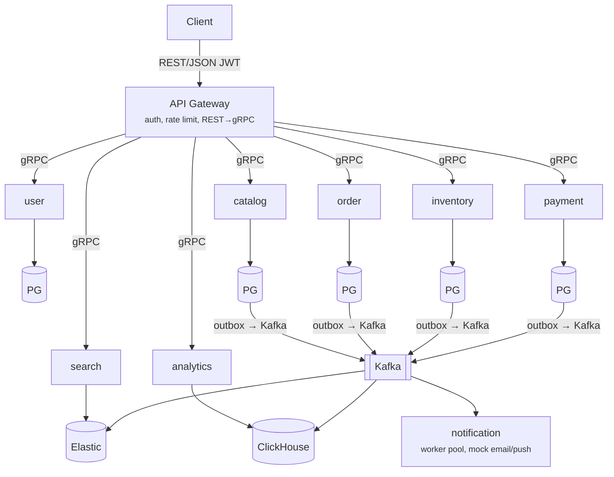
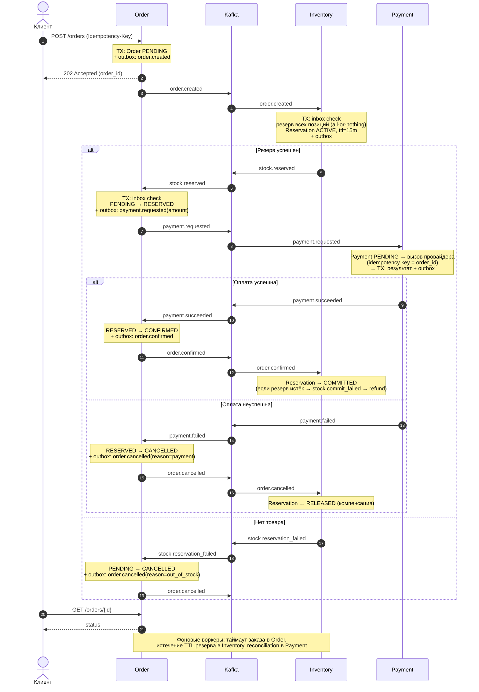

# 1. Общая схема

##  Базовые правила архитектуры

* ️ **Database-per-Service** — у каждого сервиса своя база данных. Чужие таблицы никто не читает, прямой доступ к чужим БД строго запрещен.
*  **Синхронное взаимодействие** — только через `gRPC` и **исключительно для запросов на чтение** (например, `gateway` → `catalog`).
*  **Изменения состояния** — происходят строго **асинхронно** через `Kafka`. Никаких синхронных цепочек на запись.
*  **Гарантия доставки** — события публикуются в брокер только через паттерн **Transactional Outbox** (запись в БД и отправка в очередь в рамках одной транзакции).

# 2. Главный сценарий

## Сценарий оформления заказа (сага)

Оформление заказа реализовано как **оркестрируемая сага**. Сервис Order управляет процессом: он хранит состояние заказа, отправляет команды и принимает решения. Inventory и Payment выполняют свои шаги и сообщают результат через Kafka. Сервисы не вызывают друг друга напрямую, всё общение идёт через события.

### Шаг 1. Создание заказа

Клиент отправляет `POST /orders` с заголовком `Idempotency-Key`. Если запрос придёт повторно, второй заказ не создастся.

Order в одной транзакции:
- сохраняет заказ в статусе **PENDING**;
- записывает событие `order.created` в таблицу outbox.

Клиент сразу получает ответ **202 Accepted** с `order_id`. Остальная обработка идёт асинхронно.

### Шаг 2. Резерв товара

Outbox-воркер публикует `order.created` в Kafka, событие получает Inventory. В одной транзакции Inventory:
- проверяет по inbox-таблице, не обрабатывалось ли это событие раньше;
- резервирует **все позиции заказа** сразу: либо все, либо ни одной;
- создаёт резерв в статусе **ACTIVE** со сроком жизни 15 минут;
- записывает результат в outbox.

Дальше два варианта:
- **Товар есть:** публикуется `stock.reserved`, сага переходит к шагу 3.
- **Товара нет:** публикуется `stock.reservation_failed`. Order переводит заказ в **CANCELLED** и публикует `order.cancelled` с причиной `out_of_stock`. Сага завершается.

### Шаг 3. Запрос оплаты

Order получает `stock.reserved` и после проверки inbox в одной транзакции:
- переводит заказ из PENDING в **RESERVED**;
- записывает в outbox `payment.requested` с суммой заказа. Сумму считает Order, а не клиент.

### Шаг 4. Оплата

Payment получает `payment.requested` и:
1. создаёт платёж в статусе **PENDING**;
2. вызывает платёжного провайдера с ключом идемпотентности, равным `order_id`, поэтому повторный вызов не спишет деньги дважды;
3. в одной транзакции сохраняет результат и записывает событие в outbox.

Вызов провайдера идёт вне транзакции БД, потому что это внешний сетевой запрос.

### Шаг 5а. Оплата прошла

1. Payment публикует `payment.succeeded`.
2. Order переводит заказ из RESERVED в **CONFIRMED** и публикует `order.confirmed`.
3. Inventory получает `order.confirmed` и переводит резерв в **COMMITTED**: товар окончательно списывается со склада.

Если к этому моменту резерв уже истёк и был снят, Inventory публикует `stock.commit_failed`. Order отменяет заказ и инициирует возврат денег.

### Шаг 5б. Оплата не прошла

1. Payment публикует `payment.failed`.
2. Order переводит заказ из RESERVED в **CANCELLED** и публикует `order.cancelled` с причиной `payment`.
3. Inventory получает `order.cancelled` и переводит резерв в **RELEASED**, то есть возвращает товар в доступный остаток. Это **компенсирующее действие** саги.

### Шаг 6. Получение статуса

Ответ на `POST /orders` не содержит итогового результата, поэтому клиент узнаёт статус заказа через `GET /orders/{id}` (опрос). Позже можно заменить опрос на SSE или WebSocket.

### Фоновые процессы

- **Order:** отменяет заказы, которые слишком долго висят в PENDING или RESERVED.
- **Inventory:** снимает резервы с истёкшим сроком жизни.
- **Payment:** reconciliation — перепроверяет у провайдера платежи в статусе PENDING, если сервис упал между вызовом провайдера и сохранением результата.

### Гарантии надёжности

- **Transactional outbox.** Событие пишется в БД в одной транзакции с изменением данных, поэтому события не теряются при падении сервиса.
- **Inbox (идемпотентные консьюмеры).** Kafka может доставить событие повторно, но обработано оно будет ровно один раз.
- **Стейт-машина заказа.** Переход статуса выполняется, только если текущий статус ожидаемый. События, пришедшие повторно или не по порядку, игнорируются.
- **Идемпотентность на входе и при оплате.** `Idempotency-Key` защищает от дублей заказа, `order_id` — от двойного списания денег.
- **Единая точка управления.** Inventory слушает только события Order, а не Payment. Поэтому любая отмена заказа, по любой причине, корректно снимает резерв.

# 3. Остальные сценарии (синхронное чтение через Gateway)

Раздел 2 описывает только один флоу — сагу оформления заказа, где Gateway напрямую общается лишь с Order, а всё остальное происходит асинхронно через Kafka между Order, Inventory и Payment. Но по общей схеме (раздел 1) Gateway связан gRPC-каналом со всеми сервисами кроме Notification — эти связи используются в остальных, не связанных с сагой сценариях маркетплейса.

Правило то же, что и в разделе 1: **только чтение** (и простые CRUD-команды внутри своего сервиса, не меняющие чужое состояние) синхронно через gRPC, без сцепленных цепочек записи между сервисами.

| REST (Gateway) | gRPC-вызов | Сервис |
|---|---|---|
| `POST /auth/register` | `UserService.Register` | user |
| `POST /auth/login` | `UserService.Authenticate` | user |
| `GET /users/{id}` | `UserService.GetUser` | user |
| `GET /products`, `GET /products/{id}` | `CatalogService.ListProducts` / `GetProduct` | catalog |
| `POST /products`, `PATCH /products/{id}` (продавец) | `CatalogService.CreateProduct` / `UpdateProduct` / `ArchiveProduct` | catalog |
| `GET /search?q=...` | `SearchService.SearchProducts` | search |
| `GET /products/{id}/stock` | `InventoryService.GetStock` | inventory |
| `GET /payments/{order_id}` | `PaymentService.GetPayment` | payment |
| `GET /admin/analytics/orders-summary` | `AnalyticsService.GetOrdersSummary` | analytics |
| `GET /admin/analytics/top-products` | `AnalyticsService.GetTopProducts` | analytics |

Notification в этой таблице не участвует — он не принимает вызовов от Gateway вообще, только консьюмит события из Kafka (welcome/подтверждение заказа/отмена и т.п.) и рассылает email/push.
