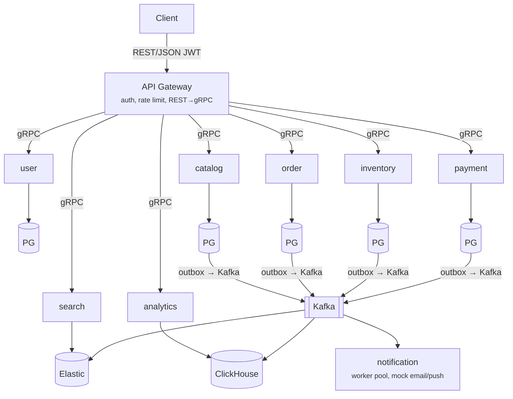
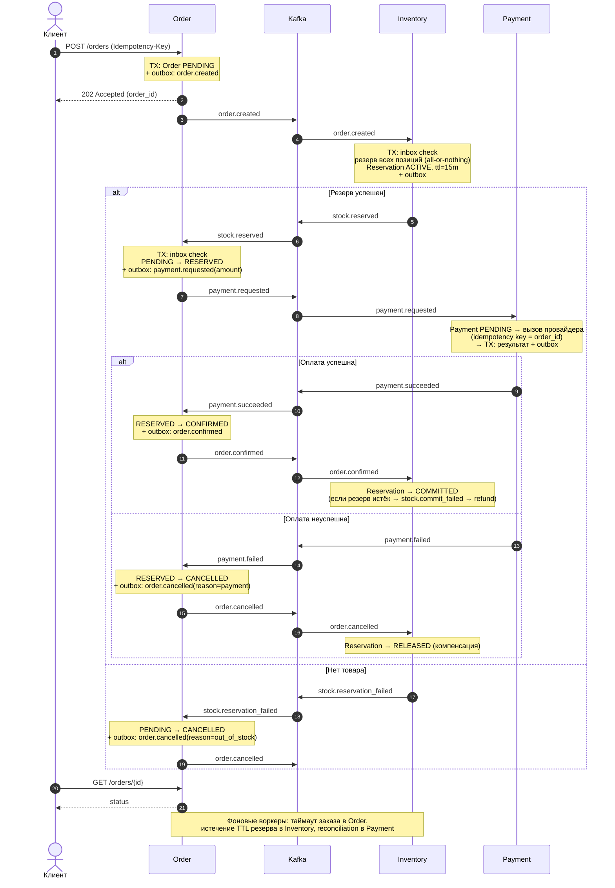

# 1. Общая схема

##  Базовые правила архитектуры

* ️ **Database-per-Service** — у каждого сервиса своя база данных. Чужие таблицы никто не читает, прямой доступ к чужим БД строго запрещен.
*  **Синхронное взаимодействие** — только через `gRPC` и **исключительно для запросов на чтение** (например, `gateway` → `catalog`).
*  **Изменения состояния** — происходят строго **асинхронно** через `Kafka`. Никаких синхронных цепочек на запись.
*  **Гарантия доставки** — события публикуются в брокер только через паттерн **Transactional Outbox** (запись в БД и отправка в очередь в рамках одной транзакции).

# 2. Главный сценарий

